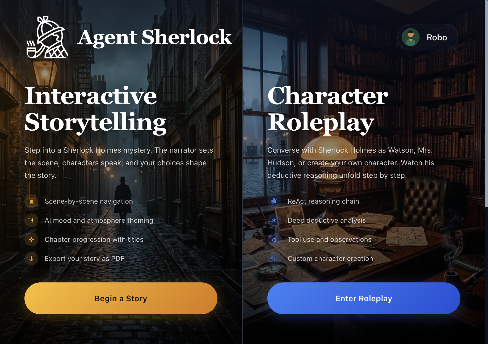
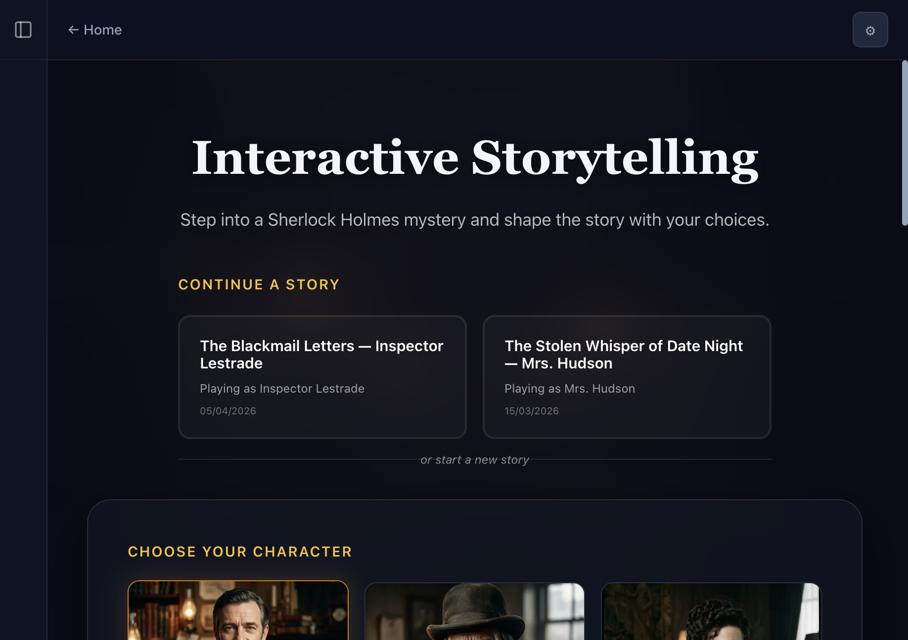
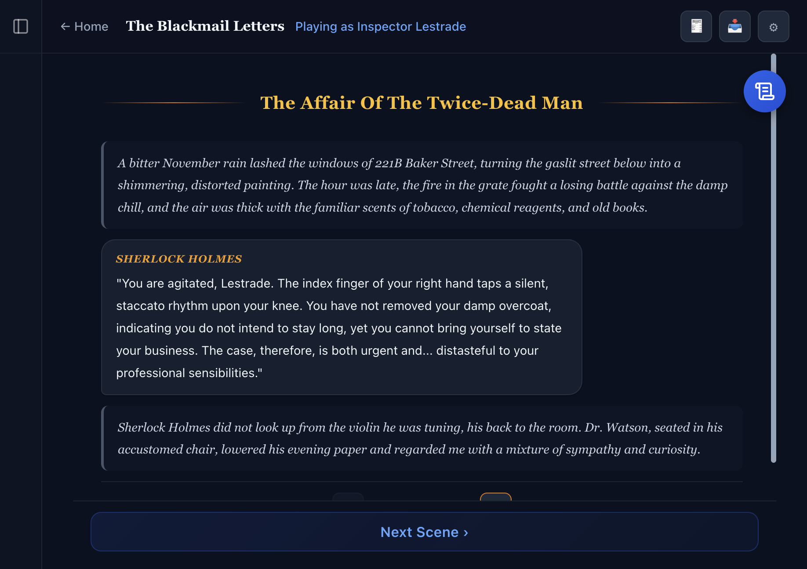
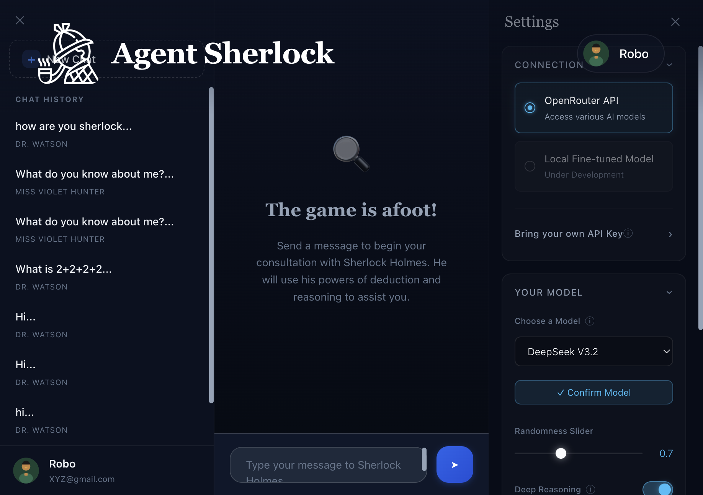

# Agent Sherlock

An interactive Sherlock Holmes AI with two modes: **story-driven mysteries** where your choices shape the narrative, and **character roleplay** where Holmes uses ReAct-style reasoning and tool use in conversation.

**[Try the Live Demo](https://agentic-sherlock.vercel.app/)** &nbsp;|&nbsp; Demo login — `Robo3` / `potatoaim123`

Built as an MSc AI dissertation exploring LLM augmentation with structured reasoning and agentic tool use.



---

## Interactive Storytelling

Pick a character (Watson, Lestrade, Irene Adler, Mrs. Hudson, or create your own), choose a mystery or let the AI generate one, and select a writing style (Classic Doyle, BBC Modern, RDJ, Noir, Simple English). The narrator builds scenes around your decisions, with chapter progression, atmosphere theming, and PDF export.

<p align="center">
  
  
</p>

## Character Roleplay

Converse with Holmes directly. He responds with visible ReAct reasoning chains (Thought → Action → Observation → Answer), uses registered tools, and maintains conversation history. Choose from 10+ models via OpenRouter including free options. Create custom characters with backstories.



---

## Tech Stack

| | |
|---|---|
| **App** | Next.js 16, React 19, TypeScript, MongoDB/Mongoose |
| **Inference** | OpenRouter API (streaming SSE), with legacy local GGUF + Coqui TTS support |
| **Fine-tuning** | QLoRA via Unsloth on the full Sherlock Holmes canon — 72.4% user preference over baseline in A/B testing |
| **Prompts** | YAML templates composed at runtime, injecting character context, story state, and tool descriptions |
| **Deployment** | Vercel + MongoDB Atlas |

---

## Repo Structure

```
sherlock-next/              → Next.js app (what's deployed)
SherlockAIChatbotWebapp/    → Original Flask prototype with local GGUF inference + TTS
ModelDevelopment/           → Fine-tuning notebooks, training data, evaluation scripts
```

---

## Getting Started

```bash
cd sherlock-next
npm install
```

Create `.env.local`:

```env
MONGODB_URI=mongodb+srv://...
SESSION_SECRET=your-secret-here
ENCRYPTION_KEY=your-32-char-key
```

```bash
npm run dev
```

Register at [agentic-sherlock.vercel.app](https://agentic-sherlock.vercel.app), add an OpenRouter API key (free tier at [openrouter.ai](https://openrouter.ai)) in Settings, and go. Or use the demo credentials above.
